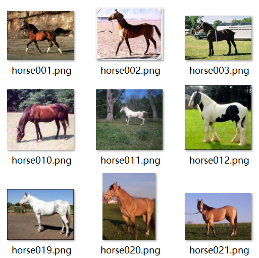
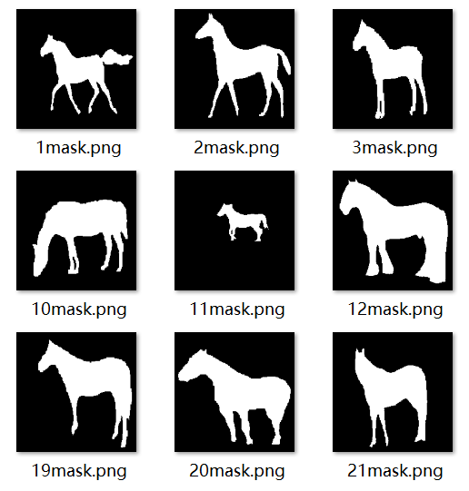
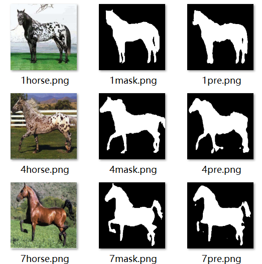

## EfficientDet模型
依据谷歌团队在CVPR 2020发表的文章<https://arxiv.org/pdf/1911.09070.pdf>.


# weizmann horse数据集

<p align="center">
  
  
</p>

weizmann horse数据集给出的马的图像和mask标签（灰度值乘255后）如上图
用于训练的数据集文件结构如下：
````
$weizmann_horse_db
├──── train_horse(278 images)
├──── train_mask(278 images)
├──── test_horse(49 images)
├──── test_mask(49 images)
````

## 安装
本次代码在python 3.7和pytorch 1.11.0上进行了测试，CUDA版本为11.3，需要的包见`requirements.txt`

## 运行说明

已经训练好的模型为model_60.pth<br/>
训练模型运行train.py<br/>
使用训练好的模型model_60.pth预测结果运行predict.py<br/>
训练的指标曲线图是train.png和test.png<br/>
实验预测图保存在“predict/”文件夹中.

## 实验结果
如下图所示：
<p align="center">
  
</p>

## 声明
此代码仅用于非商业目的，根据 ADOBE IMAGE DATASET 许可协议的规定，此存储库中包含的训练模型只能用于非商业目的。任何违反此规则的人都将自行承担风险。
